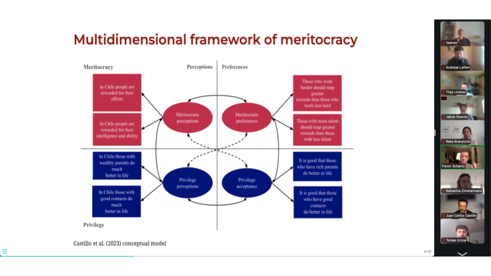
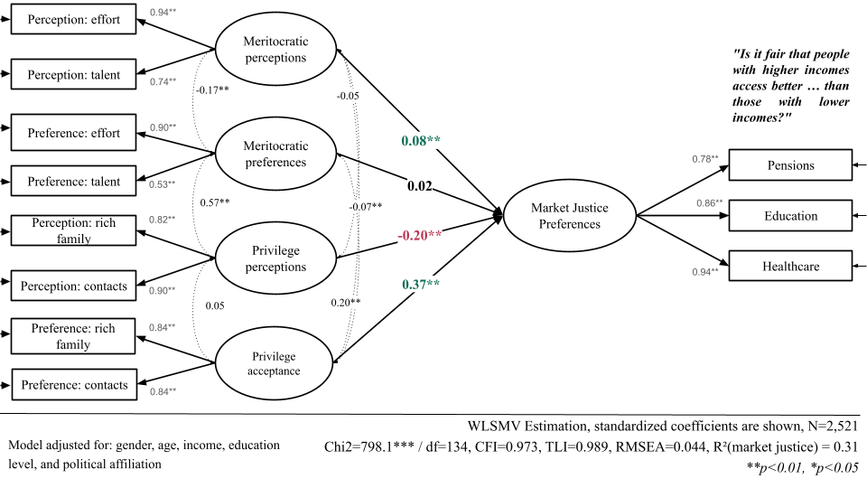

## ¡El equipo JUSMER participó en el WARN Online Workshop 2026! 💻📚

El lunes 29 de junio de 2026, el equipo JUSMER participó en el [WARN Online Workshop: Methods in Welfare Attitudes Research](https://www.linkedin.com/posts/welfare-attitudes-research-network_join-our-cloud-hd-video-meeting-activity-7472264211851743232-Geem?utm_source=share&utm_medium=member_desktop&rcm=ACoAAEbBf0YBWgrqKo42uIdmvxFacFl9PS_lQcw), organizado por la Welfare Attitudes Research Network (WARN). 

La sesión se realizó de manera virtual (Zoom) entre las 14:00 y las 15:30 CEST y reunió a investigadoras e investigadores de distintos países en torno a un objetivo común: discutir los enfoques metodológicos que se emplean hoy en el estudio de las actitudes hacia el bienestar.

<small>(📷 Equipo JUSMER en la sesión)</small>

El workshop se organizó como una sesión compacta de cinco ponencias, con 10 minutos de presentación y 5 de discusión cada una: un formato ágil que funcionó muy bien.

Las cinco contribuciones fueron:

- **Correlational Class Analysis**, por Thijs Lindner.
- **Preferences for market-based welfare: disentangling the role of merit and privilege beliefs**, por Andreas Laffert, Juan Carlos Castillo, René Canales y Tomás Urzúa (JUSMER).
- **Unpacking pension preferences via a conjoint survey experiment in Hungary**, por Reka Branyiczki.
- **The COVID Confounders: Using Counterfactual Surveys to Test the Persistence of an Attitudinal Shock**, por Trevor Schantz y Lyle Scruggs.
- **A Mixed-Methods Design for Studying Eco-Social Welfare Attitudes in Europe**, por Vincent Gengnagel, Ludwig Ipach, Christian Möstl, Philipp Rhein, Maurizio Schulz & Katharina Zimmermann.

<small>(Modelo de ecuaciones estructurales sobre percepciones y preferencias meritocráticas y de privilegio y justicia de mercado)</small>

La ponencia del equipo estuvo a cargo de Andreas Laffert y abordó cómo las percepciones y preferencias sobre la meritocracia y el privilegio moldean el apoyo a la justicia de mercado en salud, educación y pensiones en Chile. El argumento es que la mercantilización del bienestar redefine los principios de merecimiento y, con su lógica contributiva, sitúa el mérito en primer plano, convirtiendo las creencias meritocráticas en un motor central de estas preferencias. Se trata de una línea que el equipo expande sobre la base de su propia investigación previa [@castillo_perceptions_2025; @castillo_justification_2026], esta vez examinando esas creencias en sus múltiples caras, es decir, de forma multidimensional [@castillo_multidimensional_2023].

La contribución metodológica consiste en mostrar cómo modelar estas creencias mediante ecuaciones estructurales (SEM) permite estimar simultáneamente cuatro factores latentes  (percepciones meritocráticas, percepciones de privilegio, preferencias meritocráticas y aceptación del privilegio), así como estimar su relación con la justicia de mercado en un contexto que permite controlar el error de medición. Los principales hallazgos sugieren que:

- Percibir la sociedad como meritocrática se asocia con una mayor preferencia por la justicia de mercado, en línea con investigaciones previas.
- Percibir un mayor privilegio se asocia negativamente, posiblemente debido a una mayor conciencia de la desigualdad.
- Las preferencias meritocráticas no muestran un efecto, probablemente debido a su baja variabilidad en los datos.
- Aceptar el privilegio es el efecto más interesante: se asocia positivamente, lo que sugiere una legitimación de la desigualdad que refuerza el apoyo a la mercantilización del bienestar.

La participación en el WARN Online Workshop fue una valiosa instancia para dialogar sobre decisiones metodológicas con colegas que investigan temas afines, recibir comentarios sobre el análisis y fortalecer vínculos dentro de la red. 📝 El intercambio también dejó abiertas preguntas para las próximas etapas del proyecto, entre ellas, experimentos de tipo conjoint y análisis comparativos entre países.

🔗 [Presentación](https://jus-mer.github.io/multidimensional-meritocracy-mjp/presentations/WARN/warn-workshop.html#/preferences-for-market-based-welfare-disentangling-the-role-of-merit-and-privilege-beliefs-in-chile)

# Referencias

::: {#refs}
:::